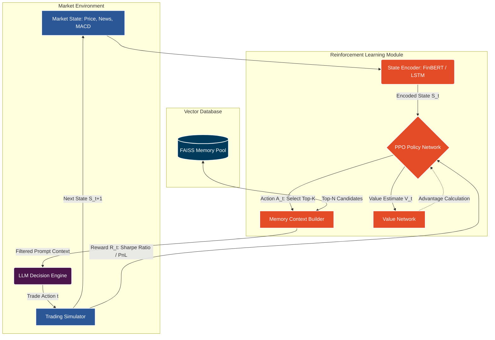

# 🧠 FinMEM Improvement 1: Deep RL for Memory Enhancement

## 📖 Overview
The base FinMEM paper relies on static rules to retrieve and boost memories (e.g., retrieving the top-$k$ most similar memories based on FAISS embeddings and applying a scalar decay). This improvement introduces a **Deep Reinforcement Learning (RL) Module** (specifically **Proximal Policy Optimization - PPO**) to dynamically select and weight memories based on their proven utility in maximizing long-term portfolio returns.

By treating "memory selection" as a sequential decision-making process, the RL agent learns which historical patterns are most relevant for the current market state, filtering out noise and actively managing the agent's context window.

---

## 🏗 Architecture Diagram

---

## 🛠 Detailed Approach

### 1. State Representation ($S_t$)
The RL agent needs to understand the current market context to decide which memories to fetch.
- **Price Features**: Moving averages (SMA), MACD, RSI, and historical volatility.
- **Market Sentiment**: Aggregated sentiment score from daily news using FinBERT.
- **Agent State**: Current portfolio value, cash position, and current risk profile (risk-averse vs. risk-seeking).

### 2. Action Space ($A_t$)
Unlike standard RL trading bots where the action is BUY/SELL, here the action is **Memory Retrieval**.
- **Discrete Formulation**: A multi-discrete action space selecting which categories of memory to prioritize (e.g., heavily weight long-term SEC filings vs. short-term price shocks).
- **Continuous Formulation**: Outputting a $K$-dimensional weight vector applied to the retrieved FAISS embeddings. If $w_i < threshold$, the memory is dropped from the LLM prompt.

### 3. Reward Shaping ($R_t$)
The reward function dictates what the RL module learns. We align it directly with financial metrics:
- $R_t = \text{Sortino Ratio}_{\Delta t} - \lambda \cdot (\text{Transaction Costs})$
- A penalty is applied if the LLM changes its mind too erratically, smoothing the trading behavior (Action Variance Penalty).
- Delayed rewards are handled via Generalized Advantage Estimation (GAE).

### 4. Training Loop (PPO)
1. **Rollout Phase**: The system simulates trading over historical data, letting the PPO agent pick memories and the LLM make trades.
2. **Advantage Calculation**: Compare actual returns to the Value Network's predictions.
3. **Policy Update**: Use clipped surrogate objective to safely update the memory-selector weights without collapsing the policy.

---

## 💾 Dataset & Requirements

### Datasets Needed
- **Training Environment Data**: 3-5 years of historical tick/daily data for S&P 500 stocks.
- **Memory Initialization Base**: 1 year of pre-processed news and SEC 10-K/10-Q filings, embedded and stored in FAISS, to act as the environment's memory pool to draw from.
- **Reward Sandbox**: Simulated transaction cost matrices (slippage models).

### Tech Stack & Libraries
| Component | Technology / Library |
|-----------|----------------------|
| **RL Framework** | `stable-baselines3`, `gymnasium` (for custom trading environments) |
| **Deep Learning** | `torch` (PyTorch for custom PPO policy networks) |
| **Vector Indexing** | `faiss-cpu` / `faiss-gpu` |
| **LLM Inference** | `boto3` (AWS Bedrock) or `openai` (DeepSeek/OpenRouter) |
| **Data Processing** | `pandas`, `numpy`, `ta` (Technical Analysis library) |

### Minimum Hardware
- **Training**: 1x NVIDIA RTX 3090 / 4090 or AWS `g4dn.xlarge` (to run the PPO environment rollouts efficiently).
- **Inference**: Can be run entirely on CPU if the LLM calls are routed via API (AWS Bedrock).

---

## 🚀 Execution Steps
1. Create a `finmem_env.py` that inherits from `gymnasium.Env`.
2. Wrap the existing `TradingSimulator` inside the Gym environment step function.
3. Replace the `brain.py` top-k logic with calls to the `ppo_agent.predict(state)`.
4. Train via `model.learn(total_timesteps=500000)`.
